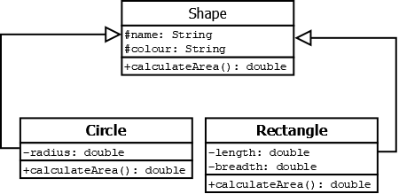
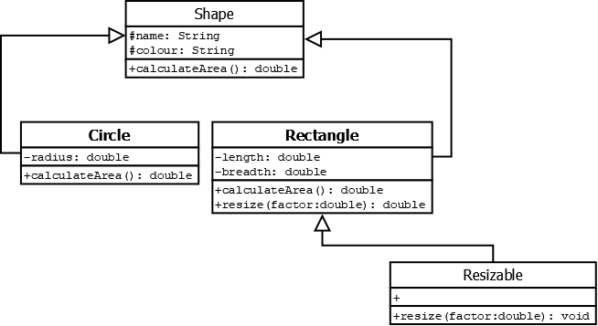
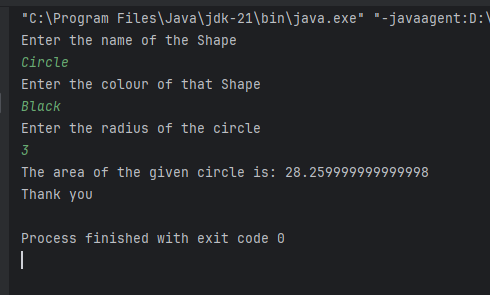

# Lab Tite: "Java OOP Basics: Understanding Inheritance Methods and Abstract classes"
# Lab Number: Four '4'
## 4.1. Objective:
The main purpose of this lab is to fullfill following objecticves:
- Understanding abstract methods and classes. 
- Declare and implement interface.
## 4.2. Materials Used:
- Text Editor:
    - Intellij IDEA
## 4.3. Theory:
- ### 4.3.1. Abstract Methods:
    An abstract class is a class that cannot be instantiated on its own and may contain abstract methods, which are declared but not implemented in the abstract class itself.

    Abstract classes provide a blueprint for concrete subclasses to implement, ensuring a common interface while allowing for variations in behavior.

    Syntax:

        abstract class class_name {
            // data members;
            // methods;
        }
- ### 4.3.2. Interface in Java:
    An interface in Java is a blueprint of a class that defines a set of abstract methods.

    Interfaces allow for the definition of common behavior that can be shared across different classes, facilitating code reuse and promoting a consistent structure in object-oriented programming. 

    #### Declaration: 
    Use the interface keyword.

        interface MyInterface {
            void myMethod();
        }

    #### Implementation:
    Classes use implements to fulfill the contract.

        class MyClass implements MyInterface {
            @Override
            public void myMethod() {
                // Implementation
            }   
        }
## 4.4. Programs:
### _Program 1 :_
1. Create an abstract class called Shape with the following properties:
name (String): The name of the shape.
color (String): The color of the shape.
2. Declare an abstract method calculateArea() in the Shape class. This method should be
responsible for calculating the area of the shape.
3. Create two concrete subclasses of Shape :
Circle : Include a radius property.
Rectangle : Include length and width properties.
4. Implement the calculateArea() method in both Circle and Rectangle classes to calculate the area of the respective shapes.

        //filename: Shape.java
        package Program1;
        abstract class Shape {
            protected String name;
            protected String colour;
            public Shape(String name, String colour) {
                this.name = name;
                this.colour = colour;
            }
            public abstract double calculateArea();
        }

        class Rectangle extends Shape {
            private int length;
            private int breadth;
            public Rectangle(String name, String colour, int length, int breadth) {
                super(name, colour);
                this.length = length;
                this.breadth = breadth;
            }

            @Override
            public double calculateArea() {
                return((double)(this.length * this.breadth));
            }
        }
        class Circle extends Shape {
            private double radius;

            public Circle(String name, String colour, double radius ) {
                super(name, colour);
                this.radius = radius;
            }
            @Override
            public double calculateArea() {
                return(3.14 * this.radius * this.radius);
            }
        }
### _Class Diagram :_

### _Program 2 :_
1. Create an interface called Resizable with the following method:
resize(double factor) : This method should resize the shape by the given factor.
2. Modify the Rectangle class to implement the Resizable interface. Implement the
resize(double factor) method to adjust the length and width of the rectangle.

        //filename: Shape.java
        package Program1;
        abstract class Shape {
            protected String name;
            protected String colour;
            public Shape(String name, String colour) {
                this.name = name;
                this.colour = colour;
            }
            public abstract double calculateArea();
        }

        class Rectangle extends Shape implements Resizable{
            private int length;
            private int breadth;
            public Rectangle(String name, String colour, int length, int breadth) {
                super(name, colour);
                this.length = length;
                this.breadth = breadth;
            }

            @Override
            public double calculateArea() {
                return((double)(this.length * this.breadth));
            }
            //program 2 ko resize garney length llai
            public void resize(double factor) {
                this.length *= factor;
                this.breadth *= factor;
            }
        }
        class Circle extends Shape {
            private double radius;

            public Circle(String name, String colour, double radius ) {
                super(name, colour);
                this.radius = radius;
            }
            @Override
            public double calculateArea() {
                return(3.14 * this.radius * this.radius);
            }
        }
        interface Resizable {
            public void resize(double factor);
        }
### _Class Diagram:_

### _Program 3 :_
1. Create a JavaTest class with the main method.
Create instances of Circle and Rectangle .
Set values for properties (name, color, radius, length, width).
Call the calculateArea() method for each shape and display the result.
2. Test the resizing functionality for a rectangle. Resize the rectangle by a factor, display the
new length and width, and recalculate the area.

        //filename: JavaTest.java
        package Program3;
        abstract class Shape {
            protected String name;
            protected String colour;
            public Shape(String name, String colour) {
                this.name = name;
                this.colour = colour;
            }
            public abstract double calculateArea();
        }

        class Circle extends Shape {
            private double radius;

            public Circle(String name, String colour, double radius ) {
                super(name, colour);
                this.radius = radius;
            }
            @Override
            public double calculateArea() {
                return(3.14 * this.radius * this.radius);
            }
        }
        interface Resizable {
            public void resize(double factor);
        }
        class Rectangle extends Shape implements Resizable {
            private int length;
            private int breadth;
            public Rectangle(String name, String colour, int length, int breadth) {
                super(name, colour);
                this.length = length;
                this.breadth = breadth;
            }

            @Override
            public double calculateArea() {
                return((double)(this.length * this.breadth));
            }
            //program 2 ko resize garney length llai
            public void resize(double factor) {
                this.length *= factor;
                this.breadth *= factor;
            }
        }
        public class JavaTest {
            public static void main(String[] args) {
                //Program 3 ko testing
                System.out.println("Enter the name of the Shape");
                Scanner scanner = new Scanner(System.in);
                String name = scanner.nextLine();
                System.out.println("Enter the colour of that Shape");
                String colour = scanner.nextLine();

                if(name.equals("Circle") || name.equals("circle")) {
                    System.out.println("Enter the radius of the circle ");
                    double radius = scanner.nextInt();
                    Circle circle = new Circle(name, colour, radius);
                    System.out.println("The area of the given circle is: "+ circle.calculateArea()+"\nThank you");
                }

                else if(name.equals("Rectangle") || name.equals("rectangle")) {
                    System.out.println("Enter the length of the rectangle ");
                    int length = scanner.nextInt();
                    System.out.println("Enter the breadth of the rectangle ");
                    int breadth = scanner.nextInt();
                    Rectangle rectangle = new Rectangle(name, colour, length, breadth);
                    System.out.println("The area of the given Rectangle is: "+ rectangle.calculateArea() +"\nThank you");
                } else {
                    System.out.println("Cannot Find the area");
                }
                scanner.close();
            }
        }

## _Output:_

## 4.5. Conslusion:
    In this Java lab, we learned how to share code using "inheritance" and set rules with "abstract classes." Hence,
    We Successfully implemented our all above objectives.

# Assignment:
    package Assignment;
    import java.util.Scanner;

    abstract class BankAccount {
        protected String accountNumber;
        protected  double currentBalance;

        public BankAccount(String accountNumber, double currentBalance) {
            this.accountNumber = accountNumber;
            this.currentBalance = currentBalance;
        }
        public void displayAccountInfo() {
            System.out.println("Your account number is: "+this.accountNumber);
            System.out.println("Your current balance is: "+this.currentBalance);
        }

        public abstract void performMaintenance();
    }

    interface Transaction {
        public void deposit(double amount);
        public void withDraw(double amount);
    }
    class SavingAccount extends BankAccount implements Transaction{
        final private double intrestRate;

        public SavingAccount(String accountNumber, double currentBalance, double intrestRate) {
            super(accountNumber,currentBalance);
            this.intrestRate = intrestRate;
        }
        @Override
        public void performMaintenance() {
            System.out.println("Let's fix bugs from SavingAccount's performMaintanence()");
        }

        @Override
        public void deposit(double amount) {
            System.out.println("Amount Deposited:");
            this.currentBalance += amount;
        }

        @Override
        public void withDraw(double amount) {
            if(currentBalance < amount) {
                System.out.println("Insufficient Balance: Withdraw of balance Failed");
            }
            else {
                System.out.println("WithDraw Succesed:");
                this.currentBalance -= amount;
            }
        }

        public double applyIntrest(double time) {
            double intrestAmount = (this.currentBalance * time * this.intrestRate)/100;
            System.out.println("Intrest Added: ");
            return (currentBalance+=intrestAmount);
        }
    }
    public class BankingSystem {
        public static void main(String[] args) {
            Scanner scanner = new Scanner(System.in);
            System.out.println("Enter the Account Number of the customer");
            String accountNumber = scanner.nextLine();
            System.out.println("Enter the current Balance: ");
            double currentBalance = scanner.nextDouble();
            System.out.println("Enter the intrest rate: ");
            double intrestRate = scanner.nextDouble();
            SavingAccount savingAccount = new SavingAccount(accountNumber, currentBalance, intrestRate);
            double amount;
            while (true) {
                System.out.println("Enter your choice:\n1. Display Account Info:\n2. Deposit\n3. WithDraw\n4. PerformMaintanence\n5. Exit()\n6. Apply Intrest");
                int choice = scanner.nextInt();
                switch (choice) {
                    case 1:
                        savingAccount.displayAccountInfo();
                        break;
                    case 2:
                        System.out.println("Enter the amount to be Deposited: ");
                        amount = scanner.nextDouble();
                        savingAccount.deposit(amount);
                        break;
                    case 3:
                        System.out.println("Enter the amount to be withdraw");
                        amount = scanner.nextDouble();
                        savingAccount.withDraw(amount);
                        break;
                    case 4:
                        savingAccount.performMaintenance();
                        break;
                    case 5:
                        System.out.println("Program Exiting...\n\t See You Soon:)");
                        System.exit(0);
                        break;
                    case 6:
                        System.out.println("Enter the time peroid: ");
                        double time = scanner.nextDouble();
                        savingAccount.applyIntrest(time);
                        break;
                    default:
                        System.out.println("Invalid Input :)");
                }
            }
        }
    }
## Output:
    Enter the Account Number of the customer
    hju23ef
    Enter the current Balance: 
    500
    Enter the intrest rate: 
    10
    Enter your choice:
    1. Display Account Info:
    2. Deposit
    3. WithDraw
    4. PerformMaintanence
    5. Exit()
    6. Apply Intrest
    1
    Your account number is: hju23ef
    Your current balance is: 500.0
    Enter your choice:
    1. Display Account Info:
    2. Deposit
    3. WithDraw
    4. PerformMaintanence
    5. Exit()
    6. Apply Intrest
    2
    Enter the amount to be Deposited: 
    500
    Amount Deposited:
    Enter your choice:
    1. Display Account Info:
    2. Deposit
    3. WithDraw
    4. PerformMaintanence
    5. Exit()
    6. Apply Intrest
    1
    Your account number is: hju23ef
    Your current balance is: 1000.0
    Enter your choice:
    1. Display Account Info:
    2. Deposit
    3. WithDraw
    4. PerformMaintanence
    5. Exit()
    6. Apply Intrest
    3
    Enter the amount to be withdraw
    900
    WithDraw Succesed:
    Enter your choice:
    1. Display Account Info:
    2. Deposit
    3. WithDraw
    4. PerformMaintanence
    5. Exit()
    6. Apply Intrest
    1
    Your account number is: hju23ef
    Your current balance is: 100.0
    Enter your choice:
    1. Display Account Info:
    2. Deposit
    3. WithDraw
    4. PerformMaintanence
    5. Exit()
    6. Apply Intrest
    6
    Enter the time peroid: 
    2
    Intrest Added: 
    Enter your choice:
    1. Display Account Info:
    2. Deposit
    3. WithDraw
    4. PerformMaintanence
    5. Exit()
    6. Apply Intrest
    1
    Your account number is: hju23ef
    Your current balance is: 120.0
    Enter your choice:
    1. Display Account Info:
    2. Deposit
    3. WithDraw
    4. PerformMaintanence
    5. Exit()
    6. Apply Intrest
    5
    Program Exiting...
        See You Soon:)

    Process finished with exit code 0