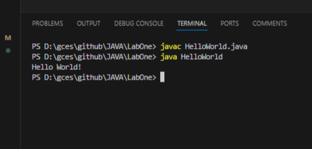
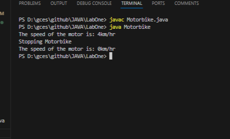
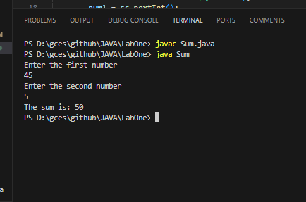
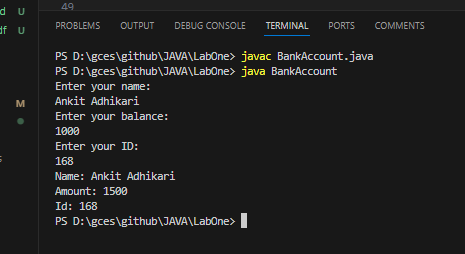
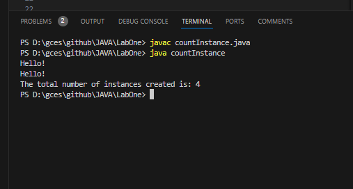

# Lab Title: Introduction to Java Programs: 
# Lab Number: One '1'
## 1.1. Objective
- To display Hello World in a simple Java Program.  
- To built simple functions classes and their objects in Java Program.  
- Take two number as input from keyboard and display their sum as result. 

## 1.2. Materials Used
- Text Editor 
    - Visual Studio Code

## 1.3. Theory
- ### 1.3.1. General Syntax of Java Program  
        access-specifier class class-name {  
            //fields  
            fieldtype fieldname;  
            //methods  
            public returnType methodName(){
                //Statement
            }
        }
  	fields include differnet types of data members and methods include differnt functions which are implemented in our Java Program

- ### 1.3.2. Class:
        - A class acts as a blueprint, defining the structure and  behavior of object.
        - It encapsulates data (attributes) and methods (functions) that operate on that data.
        - Example:
            class MyClass {
                // Fields and methods are defined here
            }

- ### 1.3.2. Methods:
        - Methods within a class represent actions or behaviors that objects of that class can perform.
        - They can have parameters (inputs) and may return values.
        - Example:
            void printHelloWorld() {
                System.out.println("Hello, World!");
            }
- ### 1.3.3.Objects:
        - An object is an instance of a class, embodying a specific entity with defined attributes and behaviors.
        - Objects have a state (attributes) and behavior (methods).
        - Example:
            	MyClass myObject = new MyClass();
  
- ### 1.3.4. Main Method and Program Execution:
        - The main method serves as the starting point for program execution.
        - It is where the program begins its execution.
        - Example:
            public static void main(String[] args) {
                // Program execution starts here
                MyClass myObject = new MyClass();
                myObject.printHelloWorld();
            }

## 1.4. Programs:
#### _1.4.1. Program1:_
    _//FileName : HelloWorld.java_

    public class HelloWorld { // creation of class HelloWOrld
            void display() {// Display function which display Hello World!
            System.out.println("Hello World!");
        }
        public static void main(String[] args) {
            HelloWorld world = new HelloWorld(); // object creation and default constructor called
            world.display();//called display function
            return;
        }
    };
- ###  _Output_
    
### _1.4.2. Program2:_
    _//FileName: Motorbike.java_

    public class Motorbike {// craetion of class Motorbike
        int speed;// Data memebers
        String model;
        public Motorbike(String model){ // methods
            this.model = model;
        }
        public void accelerte(){//method to increment speed by 1
            this.speed += 1;
        }
        public void brake(){//method to decrement speed by 1
            this.speed -= 1;
        }
        public void stop() {// method that makes speed = 0
            this.speed = 0;
        }
        public int returnSpeed(){//method that return speed of motorbike
            return (this.speed);
        }
        public static void main(String[] args) {
            Motorbike motor = new Motorbike("Honda");//default constructor called with String value 'Honda' which is assign to model
            motor.accelerte();//accelerate fn called speed =1
            motor.brake();//brake fn called which decrease the speed, speed = 0
            motor.accelerte();//speed =1
            motor.accelerte();//speed = 2
            motor.accelerte();//speed = 3
            motor.accelerte();//speed = 4
            System.out.println("The speed of the motor is: "+ motor.returnSpeed()+ "km/hr");//print speed = 4
            System.out.println("Stopping Motorbike");
            motor.stop();//making speed = 0
            System.out.println("The speed of the motor is: "+ motor.returnSpeed()+ "km/hr");//display speed = 0
            return;
        }
    }
- ### _Output_
    

### _1.4.3. Program 3:_
    _//FileName: Sum.java_

    import java.util.Scanner;//library fn which helps us to take input
    public class Sum {
        private int num1;//private data member which is accessable inside the class
        only
        private int num2;
        public Sum(int num1, int num2) {//constructor which is used to initialize
        values in num1 and num2
            this.num1 = num1;
            this.num2 = num2;
        }
    
        int returnSum(){//method which returns the sum of num1 and num2
            return(num1+num2);
        }
        public static void main(String[] args) {
            int num1, num2;
            System.out.println("Enter the first number");
            Scanner sc = new Scanner(System.in);
            num1 = sc.nextInt();//taking a integer value as input which is entered by user
            System.out.println("Enter the second number");
            num2 = sc.nextInt();//taking a integer value as input which is entered by user
            Sum sum = new Sum(num1, num2);//creating object and calling parameterized constructor
            System.out.println("The sum is: "+sum.returnSum());//displaying the sum of both numbers
            sc.close();
        }
    }
- ### _Output_
	
### _1.4.4. Program 4_ 
    //filename: BankAccount.java

    import java.util.Scanner;
    public class BankAccount {
        int balance;
        int id;
        String name;

        BankAccount(int balance, String name, int id) {
            this.balance = balance;
            this.name = name;
            this.id = id;
        }

        void readAccount() {
            Scanner scanner = new Scanner(System.in);
            System.out.println("Enter your name: ");
            name = scanner.nextLine();
            System.out.println("Enter your balance: ");
            balance = scanner.nextInt();
            System.out.println("Enter your ID: ");
            id = scanner.nextInt();
            scanner.close();
        }

        void depositBalance(int amount) {
            balance += amount;
        }

        void withdrawBalance(int amount) {
            balance -= amount;
            if (balance < 0) {
                System.out.println("Cannot withdraw");
                return;
            }
        }

        String getAccountDetails() {
            return ("Name: " + name + " Amount: " + balance + "Id: " + id);
        }

        public static void main(String[] args) {
            BankAccount ob = new BankAccount(100, "Ram", 1);
            ob.readAccount();
            // ob.getAccountDetails();
            ob.depositBalance(1000);
            ob.withdrawBalance(500);
            System.out.println(ob.getAccountDetails());
        }
    }

- ### _Output:_
    
### _1.4.5. Program 5_
    //filename: countInstance.java

    public class countInstance {
        private static int count;
        public countInstance() {
            count++;
        }
        public void sayHello() {
            System.out.println("Hello!");
        }
        public int returnCount() {
            return count;
        }

        public static void main(String[] args) {
            countInstance ob1 = new countInstance();
            countInstance ob2 = new countInstance();
            countInstance ob3 = new countInstance();
            countInstance ob4 = new countInstance();
            ob1.sayHello();
            ob2.sayHello();
            System.out.println("The total number of instances created is: " + ob1.returnCount() );
        }
    }
- ### _Output_ 
    

## Conclusion:
- After this lab, Now I can write, compile, and run Java programs. I've learned how to create classes, objects, and use fields, methods, and constructors. Additionally, I can read input from the command line.
