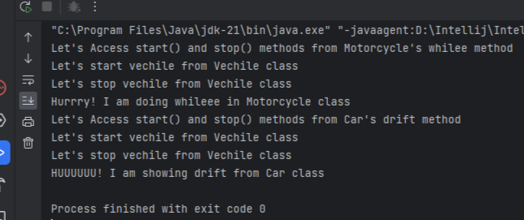

# Lab Title: "Java OOP Basics: Understanding Inheritance Methods and Abstract classes"
# Lab Number: Three '3'
## 3.1 Objectives:
The main purpose of this lab is to fullfill following objecticves:
- Understanding parent class and child class (Inheritance)
- Member access using super keyword
- Differentiating Overriding and Overloading
- Experimenting the effect of access specifier in inheritance
- Final classes and methods
## 3.2. Materials Used:
- Text Editor 
    - IntelliJ IDEA
## 3.3. Theory:
-   ### 3.3.1. Inheritance:
        Inheritance is a fundamental object-oriented programming concept where a class (subclass/derived class) inherits properties and behaviors from another class (superclass/base class).

        It promotes code reusability and establishes a "is-a" relationship between classes.

        Syntax of Inheritance:
            // Superclass (Parent class)
            class Animal {
                // Properties and methods of the Animal class
                void eat() {
                    System.out.println("Animal is eating");
                }
            }

            // Subclass (Child class) inheriting from Animal
            class Dog extends Animal {
                // Additional properties and methods of the Dog class
                void bark() {
                    System.out.println("Dog is barking");
                }
            }
-   ### 3.3.2. Super Keyword:
        The super keyword in Java is used to refer to the superclass (parent class) members (fields or methods). 
        
        It is particularly useful when there is a need to differentiate between the superclass and subclass members with the same name.
-   ### 3.3.3. Method Overriding
        Method overriding occurs when a subclass provides a specific implementation for a method that is already defined in its superclass.

        It allows a subclass to provide a specialized version of a method inherited from its superclass, tailoring the behavior to its specific needs.
-   ### 3.3.4. Method Overloading:
        Method overloading happens when a class has multiple methods with the same name but different parameter lists.

        It provides flexibility and convenience by allowing a method to perform different actions based on the number or type of parameters.
-   ### 3.3.5. Abstract Methods:
        An abstract class is a class that cannot be instantiated on its own and may contain abstract methods, which are declared but not implemented in the abstract class itself.

        Abstract classes provide a blueprint for concrete subclasses to implement, ensuring a common interface while allowing for variations in behavior.

        Syntax:
            abstract class class_name {
                // data members;
                // methods;
            }
-   ### 3.3.6. Final Keyword:
        In Java, the final keyword can be applied to variables, methods, and classes. When applied to a variable, it makes the variable a constant. When applied to a method, it prevents the method from being overridden. When applied to a class, it prevents the class from being extended.

        It ensures that certain elements (variables, methods, or classes) cannot be modified or extended, promoting immutability and preventing further customization.
##  3.4. Programs:
-   #### _Program 1:_
        //Program to show inhertance among classes:
        //filename: Vechile.java
        package LabThree.LabThreeInheritanceCode;

        public class Vechile {
            protected String make;
            protected String model;
            protected int year;

            public Vechile() {
                this.model = null;
                this.make = null;
                this.year = 0;
            }

            public Vechile(String make, String model, int year) {
                this.make = make;
                this.model = model;
                this.year = year;
            }
            public void start() {
                System.out.println("Let's start vechile from Vechile class");
            }

            public void stop() {
                System.out.println("Let's stop vechile from Vechile class");
            }

            public int year() {
                System.out.println("Let's find the manufactured date of Vechile used year method in Vechile Class");
                return (this.year);
            }
            public static void main(String[] args) {
                Motorcycle ob = new Motorcycle();
                ob.start();
                ob.stop();
                ob.whilee();
                Car ob1 = new Car();
                ob1.start();
                ob1.stop();
                ob1.drift();
            }
        }
        //filename: Car.java
        package LabThree.LabThreeInheritanceCode;

        public class Car extends Vechile{
            private int numberOfDoors;
            public void drift() {
                System.out.println("HUUUUUU! I am showing drift from Car class");
            }
        }
        //filename: Motorbike.java
        package LabThree.LabThreeInheritanceCode;

        public class Motorcycle extends Vechile{
            private boolean hasFairing;
            public void whilee() {
                System.out.println("Hurrry! I am doing whileee in Motorcycle class");
            }
        }

-   #### _Output:_
    

-   #### _Program 2:_
        //Member Accessing Using Super Keyword
        //filename: Vechile.java
        package LabThree.LabThreeInheritanceCode;

        public class Vechile {
            protected String make;
            protected String model;
            protected int year;

            public Vechile() {
                this.model = null;
                this.make = null;
                this.year = 0;
            }

            public Vechile(String make, String model, int year) {
                this.make = make;
                this.model = model;
                this.year = year;
            }
            public void start() {
                System.out.println("Let's start vechile from Vechile class");
            }

            public void stop() {
                System.out.println("Let's stop vechile from Vechile class");
            }

            public int year() {
                System.out.println("Let's find the manufactured date of Vechile used year method in Vechile Class");
                return (this.year);
            }

            public static void main(String[] args) {
                Motorcycle ob = new Motorcycle();
                ob.whilee();
                Car ob1 = new Car();
                ob1.drift();
            }
        }
        class Motorcycle extends Vechile{
            private boolean hasFairing;
            public void whilee() {
                System.out.println("Let's Access start() and stop() methods from Motorcycle's whilee method");
                super.start();
                super.stop();
                System.out.println("Hurrry! I am doing whileee in Motorcycle class");
            }
        }
        class Car extends Vechile{
            private int numberOfDoors;
            public void drift() {
                System.out.println("Let's Access start() and stop() methods from Car's drift method");
                super.start();
                super.stop();
                System.out.println("HUUUUUU! I am showing drift from Car class");
            }
        }
-   #### _Output_
    
-   #### _Program 3:_
        package LabThree.LabThreeInheritanceCode;

        abstract public class Vechile {
            protected String make;
            protected String model;
            protected int year;

            public Vechile() {
                this.model = null;
                this.make = null;
                this.year = 0;
            }

            public Vechile(String model, String make, int year) {
                this.make = make;
                this.model = model;
                this.year = year;
            }
            public void start() {
                System.out.println("Let's start vechile from Vechile class");
            }

            public void stop() {
                System.out.println("Let's stop vechile from Vechile class");
            }

            public int year() {
                System.out.println("Let's find the manufactured date of Vechile used year method in Vechile Class");
                return (this.year);
            }

            abstract public void showDetails();
            public static void main(String[] args) {
                Motorcycle ob = new Motorcycle("Yamaha", "Plastics And Steel", 2010);
                ob.showDetails();
                ob.start();
                ob.whilee();
                ob.stop();
                Car ob1 = new Car("Tesla", "Stell, Almunium And Platics", 2005);
                ob1.showDetails();
                ob1.start();
                ob1.drift();
                ob1.stop();
            }
        }

        class Car extends Vechile{
            private int numberOfDoors;

            Car(String model, String make, int year) {
                super(model,make,year);
            }
            public void drift() {
                System.out.println("Hurry!! I am showing drift from Car class");
            }
            @Override
            public void start() {
                System.out.println("Hurry!! We override method start in Car class");
            }

            @Override
            public void stop() {
                System.out.println("Hurry!! We override method stop in Car class");
            }

            @Override
            public void showDetails () {
                System.out.println("Car's Model: "+this.model);
                System.out.println("Manufactured Material: "+this.make);
                System.out.println("Manufactured Year: "+this.year);

            }
        }

        class Motorcycle extends Vechile{
            private boolean hasFairing;
            Motorcycle(String model, String make, int year) {
                super(model,make,year);
            }
            public void whilee() {
                System.out.println("Hurrry! I am doing whileee in Motorcycle class");
            }

            @Override
            public void start() {
                System.out.println("Hurry!! I override the start method in Motorbike Class");
            }

            @Override
            public void stop() {
                System.out.println("Hurry!! I override the stop method in Motorbike Class");
            }

            @Override
            public void showDetails() {
                System.out.println("Motorbike Model: "+this.model);
                System.out.println("Manufactured Materials: "+this.make);
                System.out.println("Manufactured Year: "+this.year);
            }
        }
-   #### _Output:_
    

    #### _Program 4_
        //Change protected members of vehicle to private and see the results.
        package LabThree.LabThreeInheritanceCode;

        abstract public class Vechile {
            private String make;
            private String model;
            private int year;

            public Vechile() {
                this.model = null;
                this.make = null;
                this.year = 0;
            }

            public Vechile(String model, String make, int year) {
                this.make = make;
                this.model = model;
                this.year = year;
            }
            public void start() {
                System.out.println("Let's start vechile from Vechile class");
            }

            public void stop() {
                System.out.println("Let's stop vechile from Vechile class");
            }

            public int year() {
                System.out.println("Let's find the manufactured date of Vechile used year method in Vechile Class");
                return (this.year);
            }

            abstract public void showDetails();
            public static void main(String[] args) {
                Motorcycle ob = new Motorcycle("Yamaha", "Plastics And Steel", 2010);
                ob.showDetails();
                ob.start();
                ob.whilee();
                ob.stop();
                Car ob1 = new Car("Tesla", "Stell, Almunium And Platics", 2005);
                ob1.showDetails();
                ob1.start();
                ob1.drift();
                ob1.stop();
            }
        }

        class Car extends Vechile{
            private int numberOfDoors;

            Car(String model, String make, int year) {
                super(model,make,year);
            }
            public void drift() {
                System.out.println("Hurry!! I am showing drift from Car class");
            }
            @Override
            public void start() {
                System.out.println("Hurry!! We override method start in Car class");
            }

            @Override
            public void stop() {
                System.out.println("Hurry!! We override method stop in Car class");
            }

            @Override
            public void showDetails () {
                System.out.println("Car's Model: "+this.model);
                System.out.println("Manufactured Material: "+this.make);
                System.out.println("Manufactured Year: "+this.year);

            }
        }

        class Motorcycle extends Vechile{
            private boolean hasFairing;
            Motorcycle(String model, String make, int year) {
                super(model,make,year);
            }
            public void whilee() {
                System.out.println("Hurrry! I am doing whileee in Motorcycle class");
            }

            @Override
            public void start() {
                System.out.println("Hurry!! I override the start method in Motorbike Class");
            }

            @Override
            public void stop() {
                System.out.println("Hurry!! I override the stop method in Motorbike Class");
            }

            @Override
            public void showDetails() {
                System.out.println("Motorbike Model: "+this.model);
                System.out.println("Manufactured Materials: "+this.make);
                System.out.println("Manufactured Year: "+this.year);
            }
        }
-   #### _Output:_
    

    #### _Program 5:_
        //program to convert Vehicle class to final
        //filename: Vechile.java
        package LabThree.LabThreeInheritanceCode;

        final public class Vechile {
            protected String make;
            protected String model;
            protected int year;

            public Vechile() {
                this.model = null;
                this.make = null;
                this.year = 0;
            }

            public Vechile(String model, String make, int year) {
                this.make = make;
                this.model = model;
                this.year = year;
            }
            public void start() {
                System.out.println("Let's start vechile from Vechile class");
            }

            public void stop() {
                System.out.println("Let's stop vechile from Vechile class");
            }

            public int year() {
                System.out.println("Let's find the manufactured date of Vechile used year method in Vechile Class");
                return (this.year);
            }

            public void showDetails() {
                System.out.println("hello");
            }
            public static void main(String[] args) {
                Motorcycle ob = new Motorcycle("Yamaha", "Plastics And Steel", 2010);
                ob.showDetails();
                ob.start();
                ob.whilee();
                ob.stop();
                Car ob1 = new Car("Tesla", "Stell, Almunium And Platics", 2005);
                ob1.showDetails();
                ob1.start();
                ob1.drift();
                ob1.stop();
            }
        }
        class Car extends Vechile{
            private int numberOfDoors;

            Car(String model, String make, int year) {
                super(model,make,year);
            }
            public void drift() {
                System.out.println("Hurry!! I am showing drift from Car class");
            }
            @Override
            public void start() {
                System.out.println("Hurry!! We override method start in Car class");
            }

            @Override
            public void stop() {
                System.out.println("Hurry!! We override method stop in Car class");
            }

            @Override
            public void showDetails () {
                System.out.println("Car's Model: "+this.model);
                System.out.println("Manufactured Material: "+this.make);
                System.out.println("Manufactured Year: "+this.year);

            }
        }

        class Motorcycle extends Vechile{
            private boolean hasFairing;
            Motorcycle(String model, String make, int year) {
                super(model,make,year);
            }
            public void whilee() {
                System.out.println("Hurrry! I am doing whileee in Motorcycle class");
            }

            @Override
            public void start() {
                System.out.println("Hurry!! I override the start method in Motorbike Class");
            }

            @Override
            public void stop() {
                System.out.println("Hurry!! I override the stop method in Motorbike Class");
            }

            @Override
            public void showDetails() {
                System.out.println("Motorbike Model: "+this.model);
                System.out.println("Manufactured Materials: "+this.make);
                System.out.println("Manufactured Year: "+this.year);
            }
        }
-   #### _Output:_
    
    #### _Program 6:_
        //program to convert method's of Vehicle class to final
        //filename: Vechile.java
        package LabThree.LabThreeInheritanceCode;

        public class Vechile {
            protected String make;
            protected String model;
            protected int year;

            public Vechile() {
                this.model = null;
                this.make = null;
                this.year = 0;
            }

            public Vechile(String model, String make, int year) {
                this.make = make;
                this.model = model;
                this.year = year;
            }
            final public void start() {
                System.out.println("Let's start vechile from Vechile class");
            }

            final public void stop() {
                System.out.println("Let's stop vechile from Vechile class");
            }

            public int year() {
                System.out.println("Let's find the manufactured date of Vechile used year method in Vechile Class");
                return (this.year);
            }

            public void showDetails() {
                System.out.println("hello");
            }
            public static void main(String[] args) {
                Motorcycle ob = new Motorcycle("Yamaha", "Plastics And Steel", 2010);
                ob.showDetails();
                ob.start();
                ob.whilee();
                ob.stop();
                Car ob1 = new Car("Tesla", "Stell, Almunium And Platics", 2005);
                ob1.showDetails();
                ob1.start();
                ob1.drift();
                ob1.stop();
            }
        }
        class Car extends Vechile{
            private int numberOfDoors;

            Car(String model, String make, int year) {
                super(model,make,year);
            }
            public void drift() {
                System.out.println("Hurry!! I am showing drift from Car class");
            }
            @Override
            public void start() {
                System.out.println("Hurry!! We override method start in Car class");
            }

            @Override
            public void stop() {
                System.out.println("Hurry!! We override method stop in Car class");
            }

            @Override
            public void showDetails () {
                System.out.println("Car's Model: "+this.model);
                System.out.println("Manufactured Material: "+this.make);
                System.out.println("Manufactured Year: "+this.year);

            }
        }

        class Motorcycle extends Vechile{
            private boolean hasFairing;
            Motorcycle(String model, String make, int year) {
                super(model,make,year);
            }
            public void whilee() {
                System.out.println("Hurrry! I am doing whileee in Motorcycle class");
            }

            @Override
            public void start() {
                System.out.println("Hurry!! I override the start method in Motorbike Class");
            }

            @Override
            public void stop() {
                System.out.println("Hurry!! I override the stop method in Motorbike Class");
            }

            @Override
            public void showDetails() {
                System.out.println("Motorbike Model: "+this.model);
                System.out.println("Manufactured Materials: "+this.make);
                System.out.println("Manufactured Year: "+this.year);
            }
        }
-   #### _Output:_
    
## 3.5. Conclusion:
    In this Java lab, we learned how to share code using "inheritance" and set rules with "abstract classes." When we wanted variations, we used "overriding" for different actions and "overloading" for the same action in different ways.

    We protected our code with the "final" keyword, and the "super" keyword let us grab useful stuff from our parent classes.

# Assignment:
    package LabThree.LabThreeInheritanceCode.BankAccount;
    import java.util.Scanner;

    public class BankAccount {
        protected int accountNumber;
        protected String accountHolderName;
        protected String accountHolderAddress;
        protected double currentBalance;

        BankAccount(int accountNumber, String accountHolderName, String accountHolderAddress, double currentBalance) {
            this.accountHolderAddress = accountHolderAddress;
            this.accountHolderName = accountHolderName;
            this.currentBalance = currentBalance;
            this.accountNumber = accountNumber;
        }

        public void displayBalance() {
            System.out.println("Your total balance is " + this.currentBalance);
        }

        public void deposit(int amount) {
            this.currentBalance += amount;
            System.out.println("Total Deposited Amount is: " + amount);
        }

        public void withDraw(double amount) {
            if (this.currentBalance >= amount) {
                this.currentBalance -= amount;
                return;
            }
            System.out.println("Cannot Withdraw:\nInsufficient amount in your bank Account");
        }

        void displayCurrentAmount() {
            System.out.println("Your total Amount is " + this.currentBalance);
        }

        public static void main(String[] args) {
            while (true) {
                String accountName;
                Scanner scanner = new Scanner(System.in);
                System.out.println("Enter your Name: ");
                accountName = scanner.nextLine();
                System.out.println("Enter your Account Number: ");
                int accountNumber = scanner.nextInt();
                System.out.println("Enter your Current Amount: ");
                double currentBalance = scanner.nextFloat();
                scanner.nextLine();
                System.out.println("Enter your Address");
                String accountHolderAddress = scanner.nextLine();

                System.out.println("Select your Account type: ");
                System.out.println("1. Saving Account");
                System.out.println("2. Checking Account");
                int choice = scanner.nextInt();

                switch (choice) {
                    case 1:
                        SavingAmount savingAmount = new SavingAmount(accountName, accountHolderAddress, currentBalance, accountNumber);
                        System.out.println("Press 1 to withdraw amount:\nPress 2 to Deposit Amount:\nPress 3 to calculate intrest\nPress 4 to display Amount");
                        choice = scanner.nextInt();
                        if (choice == 1) {
                            System.out.println("Enter the amount to be withdraw: ");
                            double amount = scanner.nextFloat();
                            savingAmount.withDraw(amount);
                        } else if (choice == 2) {
                            System.out.println("Enter the amount to be deposited: ");
                            int amount = scanner.nextInt();
                            savingAmount.deposit(amount);
                        } else if(choice == 3) {
                            System.out.println("Enter the intrest Rate");
                            double intrestRate = scanner.nextFloat();
                            savingAmount.setIntrestRate(intrestRate);
                            savingAmount.addIntrest();
                        }else if(choice == 4) {
                            savingAmount.displayBalance();
                        }
                        break;
                    case 2:
                        CheckingAccount checkingAccount = new CheckingAccount(accountName, accountHolderAddress, currentBalance, accountNumber);
                        System.out.println("Enter the Over Draft Limit");
                        double overDraftLimit = scanner.nextFloat();
                        checkingAccount.setOverDraftLimit(overDraftLimit);
                        System.out.println("Press 1 to withdraw amount:\nPress 2 to Deposit Amount\nPress 3 to Show your currentBalance");
                        choice = scanner.nextInt();
                        if (choice == 1) {
                            System.out.println("Enter the amount to be withdraw: ");
                            double amount = scanner.nextFloat();
                            checkingAccount.withDraw(amount);
                        } else if (choice == 2) {
                            System.out.println("Enter the amount to be deposited: ");
                            int amount = scanner.nextInt();
                            checkingAccount.deposit(amount);
                        } else if(choice == 3){
                            checkingAccount.displayBalance();
                        } else {
                            System.out.println("Invalid Input");
                        }
                        break;
                    default:
                        System.out.println("Invalid Input");
                }
                scanner.nextLine();
                String exit = scanner.nextLine();
                if(exit.equals("Yes") || exit.equals("yes") || exit.equals("Y") || exit.equals("y")) {
                    System.exit(0);
                }
            }
        }
    }
    public class CheckingAccount extends BankAccount {
        double overDraftLimit;

        CheckingAccount(String accountHolderName, String accountHolderAddress, double currentBalance, int accountNumber) {
            super(accountNumber, accountHolderName, accountHolderAddress, currentBalance);
        }

        public void setOverDraftLimit(double overDraftLimit) {
            this.overDraftLimit = overDraftLimit;
        }

        @Override
        public void withDraw (double amount) {
            double virtualAccount = currentBalance + overDraftLimit;

            if(amount <= virtualAccount) {
                currentBalance -= amount;
                System.out.println("Amount Withdraw: "+ amount + "\nThank You");
            }
            System.out.println("Insufficient Amount \nThank You");
        }
    }

    class SavingAmount extends BankAccount {
        private double intrestRate;
        SavingAmount(String accountHolderName, String accountHolderAddress, double currentBalance, int accountNumber) {
            super(accountNumber, accountHolderName, accountHolderAddress, currentBalance);
        }

        public void setIntrestRate(double intrestRate) {
            this.intrestRate = intrestRate;
        }

        public void addIntrest() {
            double intrest = this.currentBalance * intrestRate;
            System.out.println("Your total intrest is "+ intrest);
            currentBalance += intrest;
        }
    }
# Class Diagram:
