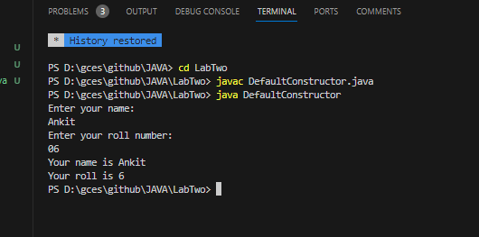
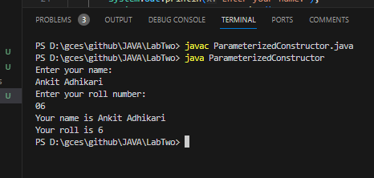
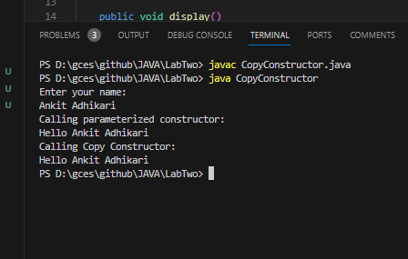
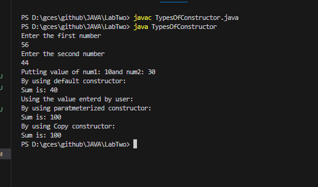
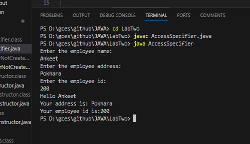
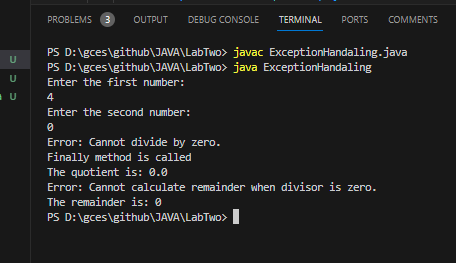
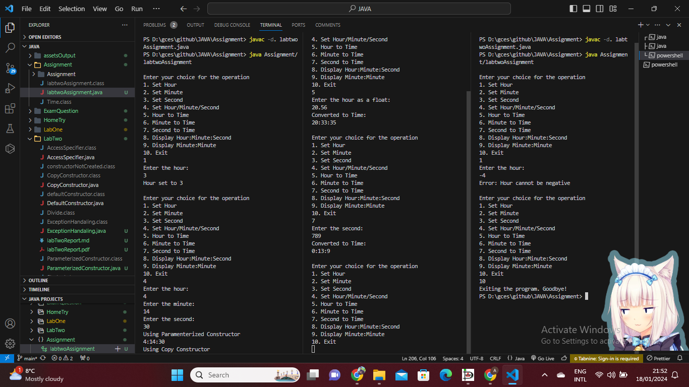

# Lab Title: Implementation of Constructors, Access Specifiers, and Exception Handling 
# Lab Number: Two '2'
## 1.1. Objective
-   Understand the different types of constructors
-   Understand the reference type and value type
-   Use Access Specifiers to limit the scope of member attributes and methods
-   Get familiar with Getter and Setters
-   Exception Handling

## 2.2. Materials Used
- Text Editor 
    - Visual Studio Code

## 2.3. Theory
-   ### 2.3.1. Constructors:
        In object-oriented programming, a constructor is a  special method that is automatically called when an object of a class is created.

        The name of a constructor must be the same as the name of the class to which it belongs.

        General syntax of constructor is: 
            public class MyClass {
                // Constructor with the same name as the class
                public MyClass() {
                    //this is default constructor
                    // Constructor logic goes here
                }
                public MyClass(returnType variable1) {
                    //this is parameterized constructor
                    //Constructor logic goes here
                }

                public MyClass(MyClass ob) {
                    //this is copy constructor
                    //Constructor logic goes here
                }
                // Other methods and attributes can also be defined in the class
            }

-   ### 2.3.2. Access Specifiers:
        Access specifiers in Java are keywords used to define the visibility and accessibility of classes, methods, and variables within a program.

        There are four access specifiers in Java:
            1. Public Access Specifier
                - accessible from any other class.
            2. Private Access Specifier
                - only accessible within the same class.
            3. Protected Access Specifier
                - accessible within the same class, within the same package, and by subclasses.

        General Syntax on how to use access specifiers in Java Program:
            public class MyClass {
                access-specifier int Variable;
    
                access-specifier void Method() {
                    // Method logic goes here
                }
            }

-   ### 2.3.2. Exception Handling:
        Exceptions represent abnormal situations that may arise due to various reasons, such as runtime errors, unexpected inputs, or external factors.

        Exception handling is a mechanism in Java that allows you to deal with unexpected or exceptional situations that may arise during the execution of a program.

        In Java, exception handling is typically done using try, catch, finally blocks.

        NullPointerException, ArrayIndexOutOfBoundsException are some examples of exceptions.

        This is the general syntax of exception handling:
            try {
            // Code that might throw an exception
            } catch (ExceptionType e) {
                // Code to handle the exception
            } finally {
                // Code that always runs
            }

## 2.4. Programs:
####     _2.4.1. Program1:_
    //purpose: to demonstrate that default constructor is created by compiler if no constructors are explicitly defined.
    //filename: DefaultConstructor.java

    import java.util.Scanner;
    class Student {
        private int roll;
        private String name;

        public void setData(int roll, String name) {
            this.roll = roll;
            this.name = name;
        }

        public int returnRoll() {
            return this.roll;
        }

        public String returnName() {
            return this.name;
        }
    }

    public class DefaultConstructor {
        public static void main(String[] args) {
            Scanner scanner = new Scanner(System.in);
            System.out.println("Enter your name:");
            String name = scanner.nextLine();
            System.out.println("Enter your roll number:");
            int roll = scanner.nextInt();
            scanner.close();
            Student std = new Student(); // Default Constructor called
            std.setData(roll, name);
            System.out.println("Your name is " + std.returnName());
            System.out.println("Your roll is " + std.returnRoll());
        }
    }
####    _Output:_

### _2.4.2. Program2:_
    //FileName: ParameterizedConstructor.java

    import java.util.Scanner;
    class Students {
        private int roll;
        private String name;

        public Students(int roll, String name) {//body of parameterized constructor
            this.roll = roll;
            this.name = name;
        }

        public int returnRoll() {//function to return roll
            return this.roll;
        }

        public String returnName() {//function to return name
            return this.name;
        }
    }

    public class ParameterizedConstructor {
        public static void main(String[] args) {
            Scanner scanner = new Scanner(System.in);
            System.out.println("Enter your name:");
            String name = scanner.nextLine();
            System.out.println("Enter your roll number:");
            int roll = scanner.nextInt();
            scanner.close();
            Students std = new Students(roll, name); // Parameterized Constructor is called No default constructor
            System.out.println("Your name is " + std.returnName());
            System.out.println("Your roll is " + std.returnRoll());
        }
    }
####    _Output_

### _2.4.3. Program 3:_
    //FileName: CopyConstructor.java

    import java.util.Scanner;

    public class CopyConstructor {
        public String name;

        public CopyConstructor(String name) {
            this.name = name;
        }

        public CopyConstructor(CopyConstructor ob1) {
            this.name = ob1.name;
        }

        public void display()
        {
            System.out.println("Hello " + name);
        }
        public static void main(String[] args) {
            Scanner scanner = new Scanner(System.in);
            System.out.println("Enter your name: ");
            String name = scanner.nextLine();
            scanner.close();
            CopyConstructor ob = new CopyConstructor(name); //Parameterized constructor
            CopyConstructor ob1 = new CopyConstructor(ob);  //Copy Constructor
            System.out.println("Calling parameterized constructor: ");
            ob.display();
            System.out.println("Calling Copy Constructor: ");
            ob1.display();
            return;
        }
    }

### _Output:_

### _2.4.4. Program 4_ 
    //filename: TypesOfConstructor.java

    import java.util.Scanner;

    public class TypesOfConstructor {
        private int num1;
        private int num2;
        public TypesOfConstructor(int num1, int num2) {//Parameterized constructor
            this.num1 = num1;
            this.num2 = num2;
            System.out.println("Using the value enterd by user:");
        }

        public TypesOfConstructor() {//Default constructor
            num1 = 10;
            num2 = 30;
            System.out.println("Putting value of num1: "+num1+"and num2: "+num2);	
        }
        public TypesOfConstructor(TypesOfConstructor ob) {//Copy constructor
            this.num1 = ob.num1;
            this.num2 = ob.num2;
        }

        public int returnSum() {// function to return sum
            return (num1 + num2	);
        }

        public static void main(String[] args) {
            System.out.println("Enter the first number");
            Scanner scanner = new Scanner(System.in);
            int num1 = scanner.nextInt();
            System.out.println("Enter the second number");
            int num2 = scanner.nextInt();
            TypesOfConstructor obj = new TypesOfConstructor(); // Default constructor 
            System.out.println("By using default constructor: \nSum is: "+ obj.returnSum());
            TypesOfConstructor obj2 = new TypesOfConstructor(num1, num2); //Parameteized Constructor
            System.out.println("By using paratmeterized constructor: \nSum is: "+ obj2.returnSum());
            TypesOfConstructor obj3 = new TypesOfConstructor(obj2); //Copy Constructor
            System.out.println("By using Copy constructor: \nSum is: "+ obj3.returnSum());
            scanner.close();
            return;
        }
    }

- ### _Output:_
    
### _2.4.5. Program 5_
    //filename: AccessSpecifier.java

    import java.util.Scanner;

    public class AccessSpecifier {
        private int employeeId;//private data member that stores the employee id
        private String employeeName;//private data member that stores the employee name
        private String employeeAddress;//private data member that stores the employee address

        public void setEmployeeId(int employeeId) { // used public access specifier to set employee id
            this.employeeId = employeeId;
        }

        public void setEmployeeName(String employeeName) {// used public access specifier to set employee name
            this.employeeName = employeeName;
        }

        public void setEmployeeAddress(String employeeAddress) {// used public access specifier to set employee address
            this.employeeAddress = employeeAddress;
        }

        public int returnsEmployeeId() {// used public access specifier to return the private data member employee id
            return this.employeeId;
        }

        public String returnsEmployeeName() {// used public access specifier to return the private data member employee name
            return this.employeeName;
        }

        public String returnsEmployeeAddress() {// used public access specifier to return the private data member employee address
            return this.employeeAddress;
        }
        public static void main(String[] args) {
            Scanner scanner = new Scanner(System.in);
            System.out.println("Enter the employee name:");
            String name = scanner.nextLine();
            System.out.println("Enter the employee address:");
            String address = scanner.nextLine();
            System.out.println("Enter the employee id:");
            int employeeId = scanner.nextInt();
            scanner.close();
            AccessSpecifier accessSpecifier = new AccessSpecifier();
            accessSpecifier.setEmployeeAddress(address);//set the address of employee
            accessSpecifier.setEmployeeId(employeeId);//set the employeeid of employee 
            accessSpecifier.setEmployeeName(name);//set the name of employee
            System.out.println("Hello "+accessSpecifier.returnsEmployeeName());//display name of employee
            System.out.println("Your address is: "+accessSpecifier.returnsEmployeeAddress());//display address of employee
            System.out.println("Your employee id is:" + accessSpecifier.returnsEmployeeId());//display employee id of employee
            return;
        }
    }
- ### _Output_ 

### _2.4.6. Program 6_
    //filename: ExceptionHandaling.java
    import java.util.Scanner;

    public class ExceptionHandaling {
        public static void main(String[] args) {
            int num1, num2;
            Scanner scanner = new Scanner(System.in);
            
            System.out.println("Enter the first number:");
            num1 = scanner.nextInt();
            
            System.out.println("Enter the second number:");
            num2 = scanner.nextInt();
            
            scanner.close();

            Divide divide = new Divide(num1, num2);

            System.out.println("The quotient is: " + divide.returnQuotient());
            System.out.println("The remainder is: " + divide.returnRemainder());
        }
    }

    class Divide {
        private int num1;
        private int num2;
        private float quotient;

        public Divide(int num1, int num2) {
            this.num1 = num1;
            this.num2 = num2;
        }

        public float returnQuotient() {
            try {
                if (num2 == 0) {
                    System.out.println("Error: Cannot divide by zero.");
                    return 0; 
                }
                quotient = (float) num1 / num2;
            } 
            catch (ArithmeticException e) {
                System.out.println("The error is: " + e);
            }
            finally {
                System.out.println("Finally method is called");
            }
            return quotient;
        }

        public int returnRemainder() {
            if (num2 == 0) {
                System.out.println("Error: Cannot calculate remainder when divisor is zero.");
                return 0;
            }
            return num1 % num2;
        }
    }
####    _Output:_

## 2.5. Conclusion:
    In conclusion,
    The implementation of constructors establishes a systematic approach to object initialization, ensuring a coherent state for instances.

    Access specifiers, such as public and private, control the visibility of class members, reinforcing encapsulation and code security. Collectively, these features contribute to a more structured, reliable, and secure Java program. 
    
    Exception handling mechanisms, including try, catch, and finally, enhance the program's resilience by managing unexpected runtime errors gracefully. The use of custom exceptions adds specificity to error signaling and handling.

# 2.6.Assignment:
###  Code:
    //filename: labtwoAssignment.java

    package Assignment;

    import java.util.Scanner;
    class InvalidInputException extends Exception {
        public InvalidInputException(String message) {
            super("Error: " + message);
        }
    }
    class Time {
        private int hour, minute, second;
        private static int count;

        public Time() {
            hour = 0;
            minute = 0;
            second = 0;
            count += 1;
        }

        public Time(int hour, int minute, int second) {
            this.hour = hour;
            this.minute = minute;
            this.second = second;
        }

        public Time(Time ob) {
            this.hour = ob.hour;
            this.minute = ob.minute;
            this.second = ob.second;
        }

        public void hoursToTime(double hourFloat) {
            this.hour = (int) hourFloat % 24;
            double remainingMinutes = (hourFloat - this.hour) * 60;
            this.minute = (int) remainingMinutes % 60;
            double remainingSeconds = (remainingMinutes - this.minute) * 60;
            this.second = (int) remainingSeconds;
        }

        public void minuteToTime(double minute) {
            this.hour = (int) minute / 60;
            this.minute = (int) (minute - (this.hour * 60));
            double remaniningMinute = minute - (this.hour * 60 + this.minute);
            this.second = (int) (remaniningMinute * 60);
        }

        public void secondToTime(int second) {
            this.hour = second / 3600;
            int remainingSecondsAfterHours = second % 3600;

            this.minute = remainingSecondsAfterHours / 60;
            this.second = remainingSecondsAfterHours % 60;
        }

        public int getHour() {
            return (this.hour);
        }

        public int getMinute() {
            return (this.minute);
        }

        public int getSecond() {
            return (this.second);
        }

        public void setHour(double hour) throws InvalidInputException{
            if(hour < 0) 
                throw new InvalidInputException("Hour cannot be negative");
            hoursToTime(hour);
        }

        public void setMinute(double minute) throws InvalidInputException {
            if(minute < 0)
                throw new InvalidInputException("Minute cannot be negative");
            minuteToTime(minute);
        }

        public void setSecond(int second) throws InvalidInputException{
            if(second < 0)
                throw new InvalidInputException("Second cannot be negative");
            secondToTime(second);
        }

        public int getCount() {
            return count;
        }

        public void display() {
            System.out.println(this.hour + ":" + this.minute + ":" + this.second);
        }
    }

    public class labtwoAssignment {
        public static void main(String[] args) {
            Scanner scanner = new Scanner(System.in);
            Time time = new Time();

            int choice;
            do {
                System.out.println("\nEnter your choice for the operation");
                System.out.println(
                        "1. Set Hour\n2. Set Minute\n3. Set Second\n4. Set Hour/Minute/Second\n5. Hour to Time\n6. Minute to Time\n7. Second to Time\n8. Display Hour:Minute:Second\n9. Display Minute:Minute\n10. Exit");
                choice = scanner.nextInt();

                switch (choice) {
                    case 1:
                        try {
                            System.out.println("Enter the hour:");
                            int hour = scanner.nextInt();
                            time.setHour(hour);
                            System.out.println("Hour set to " + hour);
                        }catch(InvalidInputException e) {
                            System.out.println(e.getMessage());
                        }
                        break;

                    case 2:
                        try {
                            System.out.println("Enter the minute:");
                            int minute = scanner.nextInt();
                            time.setMinute(minute);
                            System.out.println("Minute set to " + minute);
                        } catch (InvalidInputException e) {
                            System.out.println(e.getMessage());
                        }
                        break;

                    case 3:
                        try {
                            System.out.println("Enter the second:");
                            int second = scanner.nextInt();
                            time.setSecond(second);
                            System.out.println("Second set to " + second);
                        } catch (InvalidInputException e) {
                            System.out.println(e.getMessage());
                        }
                        break;

                    case 4:
                        System.out.println("Enter the hour:");
                        int h = scanner.nextInt();
                        System.out.println("Enter the minute:");
                        int m = scanner.nextInt();
                        System.out.println("Enter the second:");
                        int s = scanner.nextInt();
                        System.out.println("Using Paramenterized Constructor");
                        Time ob2 = new Time(h,m,s);
                        ob2.display();
                        Time ob3 = new Time(ob2);
                        System.out.println("Using Copy Constructor");
                        ob3.display();
                        break;

                    case 5:
                        System.out.println("Enter the hour as a float:");
                        double hourFloat = scanner.nextDouble();
                        time.hoursToTime(hourFloat);
                        System.out.println("Converted to Time: ");
                        time.display();
                        break;

                    case 6:
                        System.out.println("Enter the minute as a float:");
                        double minuteFloat = scanner.nextDouble();
                        time.minuteToTime(minuteFloat);
                        System.out.println("Converted to Time: ");
                        time.display();
                        break;

                    case 7:
                        System.out.println("Enter the second:");
                        int sec = scanner.nextInt();
                        time.secondToTime(sec);
                        System.out.println("Converted to Time: ");
                        time.display();
                        break;

                    case 8:
                        System.out.println("Displaying Hour:Minute:Second");
                        time.display();
                        break;

                    case 9:
                        System.out.println("Displaying Minute:Minute");
                        System.out.println(time.getMinute());
                        break;

                    case 10:
                        System.out.println("Exiting the program. Goodbye!");
                        System.exit(0);
                        break;

                    default:
                        System.out.println("Invalid choice. Please enter a valid option.");
                }

            } while (choice != 0);

            System.out.println("Total instances: " + time.getCount());
            scanner.close();
        }
    }

    // getMessage() is a method which is defined in throwable class which is the base class of all exceptions
####    _Output:_
